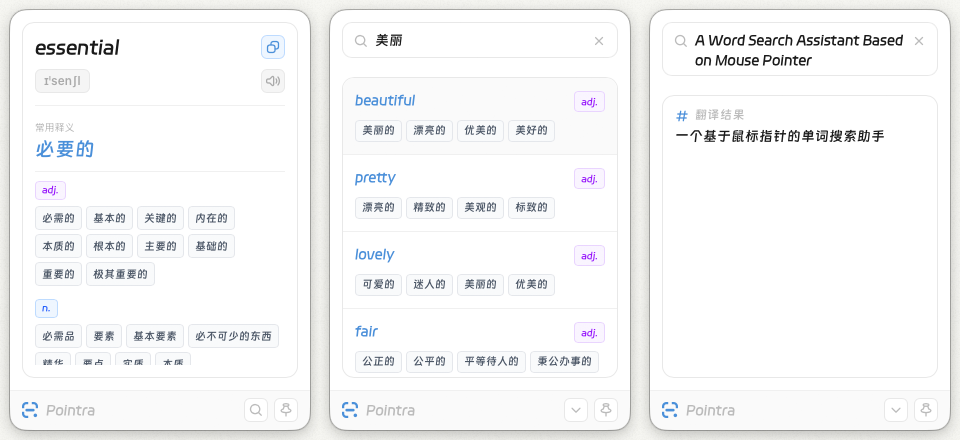

# Pointra — 光标所指 · 翻译即达

<div align="center">
  <p>
    <strong>轻量高效 &nbsp; 一款基于鼠标指针的查词助手</strong>
  </p>
  <p>
    <a href="#features">功能特性</a> •
    <a href="#quick-start">快速开始</a> •
    <a href="#tech-stack">技术栈</a> •
    <a href="#project-structure">项目结构</a> •
    <a href="#configuration">配置说明</a>
  </p>
</div>

Pointra 是一款跨平台（macOS / Windows）桌面翻译工具。核心思路是：通过屏幕截图 + OCR 技术识别光标附近的文字进行翻译，无需手动选中或输入单词，极大提升阅读和学习效率。


<p align="center">
  
</p>


---

## Features

| 功能 | 说明 |
|------|------|
| 🖱️ **光标取词** | 光标停留到单词位置，按下快捷键（默认 `F2`），自动截取光标周围区域进行 OCR 识别并翻译 |
| 📝 **选词翻译** | 选中任意文本后按下快捷键（macOS `Cmd + 1` / Windows `Alt + 1`），直接翻译 |
| 🔍 **搜索窗口** | 唤起搜索窗口（macOS `Cmd + 2` / Windows `Alt + 2`），手动输入文本进行翻译 |
| 🎯 **智能识别** | 自动判断输入文本是单词还是句子，单词展示词典详情，句子展示翻译结果 |
| 🔊 **真人发音** | 支持美式 / 英式发音，查词成功后自动播放音频 |
| 📌 **窗口置顶** | 按下 `F1` 将翻译窗口置顶，方便长时查阅 |
| 🎨 **圆角玻璃** | macOS 平台原生毛玻璃 + 圆角窗口效果 |
| ⚙️ **键自定义** | 所有快捷键均可在设置界面自定义 |
| 🖥️ **系统托盘** | 托盘菜单支持快速搜索、重启、退出 |
| 🚀 **开机自启** | 可在设置中开启开机自启 |
| 🔄 **自动更新** | 启动时检查版本更新 |


## Quick Start

### 前置依赖

- [Node.js](https://nodejs.org/) ≥ 18
- [pnpm](https://pnpm.io/)
- [Rust](https://www.rust-lang.org/) （用于编译 Tauri 后端）

### 开发

```bash
# 克隆仓库
git clone https://github.com/SYJcn/Pointra-Pub.git
cd Pointra-Pub

# 安装前端依赖
pnpm install

# 启动开发模式
pnpm tauri dev
```

### 构建

```bash
pnpm tauri build
```

构建产物位于 `src-tauri/target/release/bundle/`

## Tech Stack

| 层级 | 技术 | 用途 |
|------|------|------|
| **UI 框架** | React 19 + TypeScript | 前端界面 |
| **构建工具** | Vite 7 | 前端构建 |
| **桌面框架** | Tauri v2 | 跨平台桌面容器 |
| **状态管理** | Zustand | 全局状态管理 |
| **路由** | React Router v7 | 页面路由 |
| **UI 组件** | HeroUI（@heroui/react）| 界面组件库 |
| **图标** | @gravity-ui/icons | 图标集 |
| **CSS** | Tailwind CSS 4 | 样式方案 |
| **后端语言** | Rust | 桌面端逻辑 |
| **OCR（macOS）** | Apple Vision Framework| 屏幕文字识别 |
| **OCR（Windows）** | Windows.Media.Ocr | 屏幕文字识别 |
| **截图** | screenshots | 屏幕区域截图 |
| **全局快捷键** | tauri-plugin-global-shortcut | 快捷键注册 |
| **键盘监听** | device_query | 低层键盘状态轮询 |
| **窗口管理** | tauri-nspanel | macOS 面板窗口 |

## Project Structure

```
Pointra/
├── src/                              # 前端源码
│   ├── main/                         # 主窗口（翻译界面）
│   │   ├── components/               # 组件
│   │   │   ├── ApiError.tsx          # 翻译错误提示
│   │   │   ├── Content.tsx           # 词典翻译结果展示
│   │   │   ├── CustomToast.tsx       # 自定义 Toast
│   │   │   ├── Footer.tsx            # 底部栏
│   │   │   ├── Header.tsx            # 顶部栏
│   │   │   ├── Loading.tsx           # 加载动画
│   │   │   └── SearchContent.tsx     # 搜狗查词结果展示
│   │   ├── pages/
│   │   │   ├── HomePage.tsx          # 主页面（取词翻译）
│   │   │   └── SearchPage.tsx        # 搜索页（输入翻译）
│   │   ├── store/
│   │   │   ├── useConfigStore.ts     # 配置状态
│   │   │   └── useUiStore.ts         # UI 状态（置顶、更新）
│   │   ├── types/
│   │   │   └── transResult.ts        # 翻译结果类型
│   │   ├── utils/
│   │   │   ├── tool.ts               # 工具函数
│   │   │   └── useCustom.ts          # 自定义 Hooks
│   │   ├── App.tsx                   # 主入口组件
│   │   ├── index.html
│   │   └── index.tsx
│   ├── setting/                      # 设置窗口
│   │   ├── components/
│   │   │   ├── AboutSection.tsx      # 关于软件
│   │   │   ├── GeneralSection.tsx    # 通用设置
│   │   │   ├── KeyTag.tsx            # 快捷键标签
│   │   │   ├── Permission.tsx        # macOS 权限引导
│   │   │   ├── SettingHeader.tsx     # 设置页头部
│   │   │   └── ShortcutSection.tsx   # 快捷键设置
│   │   ├── App.tsx
│   │   ├── ConfigManager.ts          # 配置管理
│   │   ├── hooks.ts                  # 快捷键录制 Hook
│   │   ├── index.html
│   │   ├── index.tsx
│   │   ├── settingsMeta.ts           # 设置元数据
│   │   ├── types.ts                  # 类型定义
│   │   └── utils.ts                  # 工具函数
│   ├── assets/                       # 静态资源
│   └── hooks/
│       └── usePlatform.ts            # 平台检测 Hook
│
├── src-tauri/                        # Rust 后端
│   ├── src/
│   │   ├── main.rs                   # 入口
│   │   ├── lib.rs                    # 应用启动、插件注册
│   │   ├── commands/                 # Tauri 命令
│   │   │   ├── mod.rs
│   │   │   ├── access_mac.rs         # macOS 权限检测
│   │   │   ├── audio.rs              # 音频播放
│   │   │   ├── config.rs             # 配置读写
│   │   │   ├── translate.rs          # 翻译命令
│   │   │   └── window.rs             # 窗口交互命令
│   │   └── utils/                    # 工具模块
│   │       ├── mod.rs
│   │       ├── capture_mac.rs        # macOS 截图
│   │       ├── capture_win.rs        # Windows 截图
│   │       ├── define_config.rs      # 配置结构 & 持久化
│   │       ├── get_text.rs           # 文本获取（选区/光标）
│   │       ├── macos_api.rs          # macOS 原生 API 封装
│   │       ├── ocr_common.rs         # OCR 通用逻辑
│   │       ├── ocr_mac.rs            # macOS Vision OCR
│   │       ├── ocr_win.rs            # Windows OCR
│   │       ├── selection_mac.rs      # macOS 辅助功能选中文本
│   │       ├── selection_win.rs      # Windows 选中文本
│   │       ├── set_window.rs         # macOS 窗口毛玻璃效果
│   │       ├── shortcuts.rs          # 快捷键管理 & 光标监听
│   │       ├── show_window.rs        # 窗口定位与显示
│   │       ├── trans_server.rs       # 翻译 API 封装
│   │       ├── tray.rs               # 系统托盘
│   │       └── update.rs             # 版本更新检查
│   ├── Cargo.toml
│   └── tauri.conf.json
│
├── package.json
├── vite.config.ts
├── tsconfig.json
└── pnpm-lock.yaml
```

## Configuration

所有配置项均通过设置界面调整，持久化存储在 `tauri-plugin-store` 中。

| 配置项 | 默认值 | 说明 |
|--------|--------|------|
| `theme` | `light` | 主题 |
| `auto_start` | `false` | 开机自启 |
| `auto_play` | `false` | 查词后自动播放发音 |
| `pronunciation` | `us` | 发音类型 `us` / `uk` |
| `pronunciation_volume` | `50` | 音量 0-100 |
| `point_key` | `F2` | 光标翻译快捷键 |
| `pinned_key` | `F1` | 窗口置顶快捷键 |
| `hide_win_key` | `Tab` | 隐藏窗口快捷键 |
| `select_text_modifiers` | `Cmd` (macOS) / `Alt` (Windows) | 选词翻译修饰键 |
| `select_text_code` | `Digit1` | 选词翻译主键 |
| `search_win_modifiers` | `Cmd` (macOS) / `Alt` (Windows) | 搜索窗口修饰键 |
| `search_win_code` | `Digit2` | 搜索窗口主键 |

## API 接口类型

翻译服务调用 `fetch_trans_res` 命令，返回统一的结构化数据。
**因调用非官方翻译 API，此代码不予公开，仅限学习与交流使用。**
以下是 Rust 后端与 TypeScript 前端的类型定义。

### Rust（后端类型）

```rust
use serde::{Deserialize, Serialize};
use serde_json::Value;

/// 翻译 API 返回的完整词典数据
#[derive(Debug, Serialize, Deserialize, Clone)]
pub struct DictResponse {
    /// 发音数据（音标、音频地址等）
    pub voice: Value,
    /// 翻译结果（译文、来源语言、目标语言等）
    pub translate: Value,
    /// 单词卡片（释义、词形变化、同近义词等）
    #[serde(rename = "wordCard")]
    pub word_card: Value,
}

/// 前端统一的翻译查询结果
#[derive(Debug, Serialize, Deserialize, Clone)]
pub struct TransResult {
    /// 状态码：200 成功，-1 失败
    pub status: i16,
    /// 错误消息（仅失败时存在）
    pub msg: Option<String>,
    /// 翻译结果数据（仅成功时存在）
    pub data: Option<DictResponse>,
}
```

> `voice`、`translate`、`word_card` 使用 `serde_json::Value`，其内部字段来自第三方 API。

### TypeScript（前端类型）

```typescript
// ==============================
// 第三方 API 内部结构（仅供参考）
// ==============================

interface Phonetic {
    text: string;      // 音标
    type: string;      // "usa" | "uk"
    filename: string;  // 音频 URL
}

interface Voice {
    phonetic: Phonetic[];
}

interface Translate {
    from: string;      // 源语言
    to: string;        // 目标语言
    text: string;      // 查询原文
    dit: string;       // 译文 / 释义
}

interface UsualDict {
    pos: string;       // 词性，如 "n", "v"
    values: string[];  // 释义列表
}

interface SecondQuery {
    k: string;         // 标题
    v: string;         // 内容（可能含 HTML）
}

interface Exchange {
    word_third?: string[];  // 第三人称单数
    word_ing?: string[];    // 现在分词
    word_done?: string[];   // 过去分词
    word_pl?: string[];     // 复数
    word_past?: string[];   // 过去式
    word_proto?: string[];  // 原型
}

interface WordCard {
    title: string;
    show: boolean;
    usualDict: UsualDict[];
    secondQuery: SecondQuery[] | string;
    exchange: Exchange;
    levelList: string[];
}

// ==============================
// 应用统一响应结构（公开接口）
// ==============================

interface TransData {
    translate: Translate;
    wordCard: WordCard;
    voice: Voice | string;
}

interface TransResult {
    status: number;          // 200 成功，-1 失败
    data: TransData | null;
    msg: string | null;
}
```

## Platforms

| Platform | Status |
|----------|--------|
| macOS 12+ | ✅ |
| Windows 10+ | ✅  |

> **macOS 首次使用**需要授予**辅助功能权限**和**屏幕录制权限**，应用会自动引导授权流程。

## License

MIT © SYJun

---

> 官方网站：[https://pointra.syjun.vip](https://pointra.syjun.vip)
>
